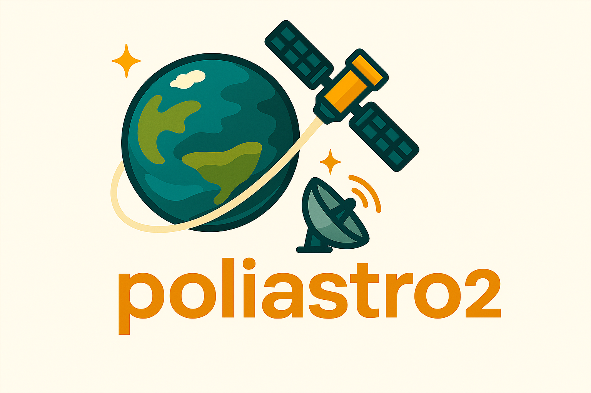

This repository is a work in progress, so no production release just yet! 🚧 But don't worry – hit `Star` and join the adventure as we keep building it together! 🚀

## Installation of poliastro2

Currently, only github installation of the development repo is avaliable.

|                             **Logo**                              | **Platform** |                                    **Command**                                    |
|:-----------------------------------------------------------------:|:------------:|:---------------------------------------------------------------------------------:|
|           |    GitHub    | ``python -m pip install https://github.com/nra-research/poliastro2/archive/refs/heads/main.zip`` |

Or setup the development repo via setup.py
```bash
$ cd your-repo
$ setup.py develop
```

## poli122: Poliastro to Poliastro2 Migration Tool
[poli122](https://github.com/nra-research/poliastro2/blob/main/src/poliastro2/dev_tools/poli122.py) is a Python script designed to simplify the process of migrating your project dependency from poliastro to poliastro2. It provides functions to automatically convert module and import paths, adapting your existing code to the new structure and organization of poliastro2.

```python
# NOTE: run conversion script ONCE; fix additional errors when needed
import os
from poliastro2.dev_tools.poli122 import convert_122
tests_dir = os.getcwd()
convert_122(tests_dir, old_parent="poliastro", new_parent="poliastro2")
```
The complete general path mapping can be viewed at: [122mapping.json](https://github.com/nra-research/poliastro2/blob/main/src/poliastro2/dev_tools/122mapping.json)

## Context
🕹️
**What is poliastro2?**

**poliastro2** is a fork of poliastro, THE astrodynamics Python library. poliastro2 builds upon the foundational capabilities of Poliastro, enhancing its modularity and extending its potential as a comprehensive astrodynamics toolbox.

🤔
**Why poliastro2?**

**poliastro2**’s primary goal is to continue the development and expansion of a purely Python-based astrodynamics simulation framework. poliastro2 has a complete new sructure that prioritizes modularity, portability, and an expanded range of simulation capabilities. This includes better representation of objects in the simulation 🌍environment, such as 📡ground stations, 🛰️spacecraft, and other 🚗moving or 🏠stationary targets.

The **poliastro2/core** is structured to facilitate continuous development. Future features will include 🗺️simulation senario, 🧲electromagnetic environment, 📻communication systems, and a variety of objects.

All general low-level functions related to calculations and data manipulation have been separated from the core structure. This separation allows for easy reuse, replacement, or extension by 🔌external modules, enabling enhanced performance and customizable algorithms.

**What's poliastro?**

 [poliastro](https://github.com/poliastro/poliastro) is an open source (MIT) pure Python library for interactive Astrodynamics and Orbital Mechanics. It was authored by Juan Luis Cano Rodríguez and maintained by the poliastro development team.

The poliastro project was archived on Oct 14, 2023 by the project owner:

> _poliastro is archived and will not be developed any further, see https://github.com/poliastro/poliastro/issues/1640 for more context._
> _Forks welcome, please respect the license by retaining attribution, and consider rebranding your fork if you intend to develop it in the long run._
> _If you still use poliastro in your work, see below how to cite it._
> _For a more complete background of the project, see https://conference.scipy.org/proceedings/scipy2022/juanluis_cano_poliastro.html._
> Per Python ad astra!

## Development API Reference

[Development API References](https://nra-research.github.io/poliastro2/)


## License

**poliastro2** follows in the tradition of **poliastro** and is released under the MIT License.

Please refer to the [License](https://github.com/nra-research/poliastro2/blob/main/License) file.

    Copyright (c) 2012-2023 Juan Luis Cano Rodríguez, Jorge Martínez Garrido, 
                            and the poliastro development team
    Copyright (c) 2025      Xiyuan Li

    Permission is hereby granted, free of charge, to any person obtaining a copy
    of this software and associated documentation files (the "Software"), to deal
    in the Software without restriction, including without limitation the rights
    to use, copy, modify, merge, publish, distribute, sublicense, and/or sell
    copies of the Software, and to permit persons to whom the Software is
    furnished to do so, subject to the following conditions:
    
    The above copyright notice and this permission notice shall be included in all
    copies or substantial portions of the Software.
    
    THE SOFTWARE IS PROVIDED "AS IS", WITHOUT WARRANTY OF ANY KIND, EXPRESS OR
    IMPLIED, INCLUDING BUT NOT LIMITED TO THE WARRANTIES OF MERCHANTABILITY,
    FITNESS FOR A PARTICULAR PURPOSE AND NONINFRINGEMENT. IN NO EVENT SHALL THE
    AUTHORS OR COPYRIGHT HOLDERS BE LIABLE FOR ANY CLAIM, DAMAGES OR OTHER
    LIABILITY, WHETHER IN AN ACTION OF CONTRACT, TORT OR OTHERWISE, ARISING FROM,
    OUT OF OR IN CONNECTION WITH THE SOFTWARE OR THE USE OR OTHER DEALINGS IN THE
    SOFTWARE.